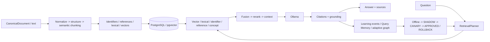

# AkmAI

AkmAI is a **local-first multilingual evidence RAG engine** built on Spring Boot, Spring AI, Ollama and PostgreSQL/pgvector.

It is designed for enterprise knowledge bases where retrieval correctness, ACL isolation, lifecycle control, citations, reproducibility and local deployment matter more than a minimal `embedding -> vector DB -> LLM` demo.

## Current status

Self-Optimizing RAG Platform **v1.1 is implemented in `main`**. The normal CI/retrieval-quality/image-build path is green on the current audited main ref, while final release qualification still requires a retained live quality baseline, SMALL/MEDIUM performance evidence and semantic-grounding calibration.

Current readiness decision:

- **READY** for local development, integration and controlled internal/pilot deployments;
- **CONDITIONAL** for production use after the target deployment passes the integrated v1.1 qualification workflow;
- **NOT YET externally release-qualified** for broad legal/medical/technical accuracy claims until a human-reviewed real-world benchmark and release evidence are retained.

See [`docs/audit/post-v1.1-readiness-2026-10-08.md`](docs/audit/post-v1.1-readiness-2026-10-08.md) for the current audit and release blockers.

## Goals

AkmAI focuses on:

- 11 target languages: Kazakh, Russian, English, Chinese, German, French, Spanish, Portuguese, Italian, Turkish and Greek;
- legal, medical and technical documents;
- local/private deployments;
- evidence-first answers with citations and grounding;
- exact business-identifier retrieval independent from embeddings;
- controlled self-optimization rather than uncontrolled online learning.

Canonical model baseline:

- embeddings: `qwen3-embedding:4b`;
- embedding dimensions: `1024`;
- vector distance: cosine;
- ANN: HNSW;
- generation: `qwen3:8b`.

Embedding profile drift fails fast. A new encoder is introduced through a new versioned embedding profile, full re-embedding, validation and atomic publication; vectors from different profiles are never mixed.

## Architecture

AkmAI separates five cooperating planes:

1. **INGEST** — normalize canonical content, preserve domain structure, semantic chunking, identifiers/references, embeddings and publication.
2. **RETRIEVE** — analyze the question and execute applicable retrieval lanes under ACL/lifecycle fences.
3. **GENERATE** — fuse, rerank, expand bounded context and generate locally with Ollama.
4. **VERIFY** — validate citations, deterministic grounding and optional semantic claim/evidence consistency.
5. **LEARN / OPERATE** — collect bounded evidence, maintain adaptive memory, evaluate policies, observe latency/saturation and manage rollout.



The key runtime rule is:

```text
similarity -> relevance -> authority -> evidence -> grounded answer
```

## Retrieval

The production retrieval path is intentionally multi-lane:

- **VECTOR** — pgvector/HNSW semantic retrieval;
- **LEXICAL** — PostgreSQL full-text/trigram retrieval;
- **IDENTIFIER** — exact business identifiers such as contract/document/order/case numbers;
- **REFERENCE** — document anchors and cross references;
- **CONCEPT / graph-assisted retrieval** — bounded semantic associations when enabled and approved.

Results are fused, reranked and context-budgeted before generation. Exact identifiers and authority rules do not depend on vector similarity.

Supported business identifier parsers currently include:

- `CONTRACT_NUMBER`
- `DOCUMENT_NUMBER`
- `ORDER_NUMBER`
- `INVOICE_NUMBER`
- `APPLICATION_NUMBER`
- `CASE_NUMBER`

## Semantic chunking and provenance

Chunking protects meaning before size. The pipeline preserves legal rules/exceptions, medical dosage/contraindication relationships, section boundaries and cross references.

Default token policy:

```text
target      750
soft max   1200
hard max   1800
minimum    250
```

`CanonicalDocument` ingestion can preserve block provenance through the full chain:

```text
answer -> source -> chunk -> canonical block -> page / section / bbox -> original source
```

The original file remains an external source concern; AkmAI owns semantic normalization, chunking, retrieval projections and evidence.

## Security and lifecycle invariants

AkmAI treats security/lifecycle as retrieval constraints, not post-processing:

- ACL scope is resolved before retrieval and revalidated before final context;
- only published generations are eligible;
- TTL expiry is synchronously fenced during retrieval;
- non-local startup fails closed if API-key security is disabled or local bypass is enabled;
- non-local deployments require explicit non-default DB credentials;
- request bodies are byte-bounded even when transfer length is unknown/chunked;
- embedding migrations use DB-backed lease ownership and fencing tokens.

## Self-optimizing v1.1

AkmAI learns **how to retrieve knowledge**, not what authoritative knowledge is.

```text
MEASURE
  -> RETRIEVE
  -> GENERATE
  -> VERIFY
  -> LEARN
  -> OFFLINE EVALUATE
  -> SHADOW
  -> CANARY
  -> APPROVE / ROLLBACK
  -> MEASURE AGAIN
```

Implemented safeguards include:

- persistent Query Memory with PostgreSQL source of truth and bounded Caffeine L1;
- ACL / embedding-profile / policy namespace isolation;
- privacy-safe HMAC query/source fingerprints;
- duplicate suppression and source/query diversity gates;
- feedback trust classes and anti-poisoning caps;
- evidence-trained retrieval-policy candidates;
- SHADOW replay that cannot affect the user answer;
- bounded CANARY cohort routing with simultaneous CONTROL evidence;
- automatic fail-closed promotion gates and rollback semantics;
- request-level policy/cohort attribution for reproducibility.

Detailed engineering contract: [`docs/architecture/rag-self-optimizing-platform-v1.1-technical-spec.md`](docs/architecture/rag-self-optimizing-platform-v1.1-technical-spec.md).

## Release qualification

The integrated release workflow is:

`.github/workflows/rag-v1.1-release-qualification.yml`

A release is qualified only when all three gates succeed for the same SHA/tag:

1. **quality** — production RAG pipeline + immutable baseline comparison;
2. **performance** — SMALL and MEDIUM application-level profiles;
3. **semantic grounding** — live RU/KK/EN calibration.

The final workflow emits `rag-v1.1-qualification.json` with `qualified=true` only when all required sub-gates pass.

### Controlled benchmark

The repository contains a deterministic `CONTROLLED_SYNTHETIC` benchmark materializer with:

- 330 labelled queries;
- 255 answerable cases;
- 75 unanswerable cases (22.7%);
- all 11 target languages;
- LEGAL / MEDICAL / TECHNICAL domains;
- required query classes and difficulty levels;
- deterministic child-chunk truth validated against production chunking.

This dataset is a **release-engineering/regression gate**, not a real-world domain-accuracy claim. See [`benchmarks/rag-benchmark-v1/README.md`](benchmarks/rag-benchmark-v1/README.md).

## Operations

The operations plane includes:

- Micrometer / Prometheus metrics;
- Grafana dashboards and alerts;
- OpenTelemetry export;
- bounded executor saturation telemetry;
- PostgreSQL / HNSW diagnostics;
- production container image build;
- lifecycle/retention/reconciliation monitoring;
- canonical-source rebuild and disaster-recovery procedures.

Resource deadlines are enforced at the retrieval worker/JDBC/model transport boundaries. `strategy-timeout < request-timeout` is a validated configuration invariant, and late dependent work is not started without a full remaining resource budget.

## Local quick start

Start PostgreSQL + pgvector:

```bash
docker compose up -d postgres
```

Install Ollama models:

```bash
ollama pull qwen3-embedding:4b
ollama pull qwen3:8b
```

Run AkmAI:

```bash
mvn spring-boot:run
```

## Ingest text

```http
POST /api/knowledge/text
Content-Type: application/json
```

```json
{
  "documentId": "law-001",
  "title": "Bank service agreement",
  "text": "Статья 25. Расторжение договора ...",
  "source": "agreement.md",
  "language": "ru",
  "domain": "LEGAL",
  "accessLevel": 1,
  "metadata": {
    "version": "2026-01"
  }
}
```

## Ask a question

```http
POST /api/rag/ask
Content-Type: application/json
```

```json
{
  "question": "Когда банк вправе расторгнуть договор?"
}
```

The answer is generated from the bounded evidence context and returned with validated source references/provenance.

## Re-embedding

AkmAI treats every embedding space as versioned. Migration uses:

```text
canonical chunks
  -> new EmbeddingProfile
  -> full re-embedding generation
  -> quality/storage validation
  -> atomic publication
  -> old-generation retirement
```

Multi-replica migration ownership is DB-visible and fenced by owner lease + fencing token.

## Production release checklist

Before calling a deployment release-qualified:

1. keep `main` CI green;
2. establish and review `benchmarks/rag-benchmark-v1/baselines/approved.json`;
3. run the integrated v1.1 release-qualification workflow against live Ollama;
4. retain quality, SMALL/MEDIUM performance, grounding and final qualification artifacts;
5. enable branch protection / required checks for `main`;
6. derive target-hardware SLOs from measured p95/p99, throughput and saturation;
7. use a separately versioned human-reviewed corpus for external legal/medical/technical quality claims.

## Documentation map

- [Post-v1.1 readiness audit](docs/audit/post-v1.1-readiness-2026-10-08.md)
- [Self-Optimizing RAG v1.1 technical spec](docs/architecture/rag-self-optimizing-platform-v1.1-technical-spec.md)
- [Self-Optimizing RAG v1 gap-remediation blueprint](docs/architecture/rag-self-optimizing-platform-v1-gap-remediation.md)
- [Benchmark contract](benchmarks/rag-benchmark-v1/README.md)
- [Adaptive graph architecture](docs/architecture/adaptive-chunk-graph.md)
- [Adaptive-memory statistical evaluation](docs/architecture/adaptive-memory-statistical-evaluation.md)

## Next milestones

The next phase is **qualification and evidence**, not new retrieval algorithms:

1. establish the immutable approved quality baseline;
2. complete and retain one successful integrated v1.1 release qualification;
3. enable required checks / branch protection for `main`;
4. build a human-reviewed representative corpus for external quality claims;
5. qualify latency/throughput/SLOs on target hardware;
6. reconcile stale historical defect issues with the already-merged remediation.
