# AkmAI

AkmAI is a **local-first multilingual evidence RAG engine** built on Spring Boot, Spring AI, Ollama and PostgreSQL/pgvector.

It targets enterprise knowledge bases where retrieval correctness, ACL isolation, lifecycle control, citations, reproducibility and local deployment matter more than a minimal `embedding -> vector DB -> LLM` demo.

## Current status

Self-Optimizing RAG Platform **v1.1 is implemented in `main`**. Core ingestion, hybrid retrieval, grounding, adaptive-memory and release-engineering infrastructure are present. Formal release qualification still depends on retained live quality/performance/grounding evidence, an approved immutable benchmark baseline, target-hardware SLO evidence and repository governance.

Current decision:

- **READY** for local development, integration and controlled internal/pilot deployments;
- **CONDITIONAL** for a production candidate after deployment-specific qualification;
- **NOT YET externally release-qualified** for broad legal/medical/technical accuracy claims.

See:

- [`docs/README.md`](docs/README.md) — documentation entry point;
- [`docs/architecture/current-runtime-architecture.md`](docs/architecture/current-runtime-architecture.md) — authoritative runtime map;
- [`docs/audit/post-v1.1-readiness-2026-10-08.md`](docs/audit/post-v1.1-readiness-2026-10-08.md) — readiness decision and blockers.

## Goals

AkmAI focuses on:

- 11 target languages: Kazakh, Russian, English, Chinese, German, French, Spanish, Portuguese, Italian, Turkish and Greek;
- legal, medical and technical documents;
- local/private deployments;
- evidence-first answers with citations and grounding;
- exact business-identifier retrieval independent from embeddings;
- generation-aware lifecycle and provenance;
- controlled self-optimization rather than uncontrolled online learning.

Canonical model baseline:

```text
embeddings   qwen3-embedding:4b
vectors      1024 dimensions
metric       cosine
ANN          HNSW
generation   qwen3:8b
```

Embedding profile drift fails fast. A new encoder is introduced through a versioned embedding profile, full re-embedding, validation and atomic publication. Vectors from different embedding profiles are never mixed even when dimensionality matches.

## Architecture

AkmAI separates five cooperating planes:

1. **INGEST** — normalize canonical content, preserve structure, chunk, enrich, embed and publish.
2. **RETRIEVE** — analyze a question and execute applicable evidence lanes under ACL/lifecycle fences.
3. **GENERATE** — fuse, rerank, expand and budget evidence before local generation.
4. **VERIFY** — validate citations and grounding before accepting the answer.
5. **LEARN / OPERATE** — collect bounded observations, maintain adaptive memory, evaluate policies and operate the service.

```mermaid
flowchart LR
    DOC[Canonical content]
    ING[Normalize / structure / semantic chunking]
    IDX[Identifiers / references / lexical / vectors / concepts]
    DB[(PostgreSQL / pgvector)]

    Q[Question]
    PLAN[RetrievalPlanner]
    RET[Vector / lexical / identifier / reference / concept]
    FUSE[ResultFusion]
    RR[Reranker]
    EXP[Structural + adaptive expansion]
    B[Context budget + revalidation]
    LLM[Ollama]
    VERIFY[Citations + grounding]
    OUT[Answer + sources]

    LEARN[Query Memory / association learning / utility]
    POLICY[Offline -> SHADOW -> CANARY -> APPROVED / ROLLBACK]

    DOC --> ING --> IDX --> DB
    Q --> PLAN --> RET --> FUSE --> RR --> EXP --> B --> LLM --> VERIFY --> OUT
    DB --> RET
    VERIFY --> LEARN --> POLICY
    POLICY --> PLAN
```



The key rule is:

```text
similarity -> relevance -> authority -> bounded evidence -> grounded answer
```

## Retrieval lanes

The base retrieval path is multi-lane:

- **VECTOR** — pgvector/HNSW semantic retrieval;
- **LEXICAL** — PostgreSQL full-text/trigram retrieval;
- **IDENTIFIER** — exact business identifiers;
- **REFERENCE** — explicit document anchors/cross references;
- **CONCEPT** — semantic concept retrieval when enabled.

Results are fused and reranked before expansion/context selection. Exact identifiers and explicit references preserve distinct authority semantics; they are not treated as ordinary vector matches.

### Adaptive graph is not a fifth peer RRF lane

The **Adaptive Association Graph** is a post-rerank bounded retrieval-memory layer. It learns generation-aware chunk associations from successful grounded usage, maintains them through `CANDIDATE -> WARM -> HOT` lifecycle bands, and can add one-hop neighbours only when explicitly enabled.

Current graph responsibilities are deliberately split:

```text
ADAPTIVE_GRAPH_LEARNING_ENABLED
  -> create/reinforce candidate associations

ADAPTIVE_GRAPH_MAINTENANCE_ENABLED
  -> score, decay, promote/demote, quota and purge

ADAPTIVE_GRAPH_SHADOW_EXPANSION_ENABLED
  -> measure what graph expansion would add

ADAPTIVE_GRAPH_EXPANSION_ENABLED
  -> allow eligible WARM/HOT neighbours into live retrieval context
```

Repository defaults keep these graph switches **off**. With default configuration the graph does not learn or affect user answers.

Detailed runtime contract: [`docs/architecture/adaptive-graph-runtime.md`](docs/architecture/adaptive-graph-runtime.md).

## Adaptive graph safety boundaries

- learned edges exist inside exactly one `access_level`;
- node identity is `(access_level, document_id, generation, chunk_id)`;
- graph-origin hits are excluded from normal association-pair learning, preventing direct self-reinforcement;
- graph lookup is bounded one-hop adjacency, not arbitrary multi-hop reasoning;
- neighbours are re-resolved through current published projections before becoming evidence;
- graph evidence has lower authority than exact identifiers and explicit references;
- graph candidates still pass context, lifecycle, citation and grounding gates.

## Business identifiers

Runtime-supported identifier parsers include:

- `CONTRACT_NUMBER`
- `DOCUMENT_NUMBER`
- `ORDER_NUMBER`
- `INVOICE_NUMBER`
- `APPLICATION_NUMBER`
- `CASE_NUMBER`

Identifier retrieval is independent from semantic similarity.

## Semantic chunking and provenance

Chunking protects meaning before size. The pipeline preserves structural boundaries and domain-sensitive atomic units such as legal rule/exception relationships and medical dosage/contraindication relationships.

Current parent chunk defaults from `application.yml`:

```text
target      550 tokens
soft max    650 tokens
hard max    900 tokens
minimum     250 tokens
```

Current child chunk defaults:

```text
minimum     250 tokens
target      275 tokens
maximum     300 tokens
```

The parent-child expansion path is enabled by default and remains bounded.

Provenance can be preserved through the evidence chain:

```text
answer
  -> cited source
  -> retrieval hit / chunk
  -> canonical block / section / page metadata
  -> original source reference
```

## Security and lifecycle invariants

AkmAI treats security/lifecycle as retrieval constraints, not final redaction:

- ACL scope is resolved before retrieval and revalidated before final context;
- only eligible published generations may enter context;
- TTL expiry is synchronously fenced during retrieval;
- learned graph edges cannot cross ACL boundaries;
- non-local startup fails closed for unsafe security/local-bypass/default-credential combinations;
- request bodies are byte-bounded even for unknown/chunked transfer;
- embedding migrations use database-backed ownership, lease and fencing tokens.

## Generation and verification

The LLM receives only bounded selected evidence.

```text
final context
  -> ContextAssembler
  -> Ollama / qwen3:8b
  -> CitationValidator
  -> deterministic grounding
  -> optional semantic grounding
  -> accepted answer or insufficient-information fallback
```

Generated prose is not accepted merely because the model returned text.

## Self-optimizing v1.1

AkmAI learns **how to retrieve knowledge**, not what authoritative knowledge is.

```text
MEASURE
  -> RETRIEVE
  -> GENERATE
  -> VERIFY
  -> LEARN
  -> OFFLINE EVALUATE
  -> SHADOW
  -> CANARY + CONTROL
  -> APPROVE / ROLLBACK
  -> MEASURE AGAIN
```

Implemented safeguards include:

- persistent Query Memory with PostgreSQL source of truth and bounded L1 cache;
- ACL / embedding-profile / policy namespace isolation;
- privacy-safe query/source fingerprints;
- duplicate suppression and source/query diversity gates;
- feedback trust classes and anti-poisoning caps;
- evidence-trained retrieval-policy candidates;
- SHADOW replay that cannot change the user answer;
- bounded CANARY routing with simultaneous CONTROL evidence;
- fail-closed promotion gates and rollback semantics;
- request-level policy/cohort attribution for reproducibility.

Engineering contract: [`docs/architecture/rag-self-optimizing-platform-v1.1-technical-spec.md`](docs/architecture/rag-self-optimizing-platform-v1.1-technical-spec.md).

## Runtime feature defaults

Several adaptive/self-optimizing capabilities intentionally default to disabled and must be promoted through evidence. Relevant repository defaults include:

```text
adaptive graph learning          false
adaptive graph maintenance       false
adaptive graph shadow expansion  false
adaptive graph online expansion  false
adaptive graph competition       false
adaptive retrieval planner       false
self-optimizing learning events  false
persistent query memory          false
semantic grounding               false
execution observations           false
router learning                  false
```

Always verify `src/main/resources/application.yml` and runtime app-parameter overrides for the target deployment.

## Release qualification

Integrated workflow:

`.github/workflows/rag-v1.1-release-qualification.yml`

A release is qualified only when the required quality, performance and semantic-grounding evidence succeeds for the same candidate SHA/tag and final qualification output marks the candidate qualified.

### Controlled benchmark

The repository contains a deterministic `CONTROLLED_SYNTHETIC` corpus with labelled answerable/unanswerable cases across all target languages and LEGAL / MEDICAL / TECHNICAL domains.

This corpus is a **regression and release-engineering asset**. It is not sufficient by itself for broad real-world domain-accuracy claims.

See [`benchmarks/rag-benchmark-v1/README.md`](benchmarks/rag-benchmark-v1/README.md).

## Operations

The operations plane includes:

- Micrometer / Prometheus metrics;
- Grafana dashboards and alerts;
- OpenTelemetry export;
- bounded executor saturation telemetry;
- PostgreSQL / HNSW diagnostics;
- lifecycle/retention/reconciliation workers;
- adaptive graph metrics/maintenance;
- production container build;
- canonical-source rebuild / disaster recovery procedures.

Timeouts are enforced at retrieval worker/JDBC/model transport boundaries. `strategy-timeout < request-timeout` is a validated runtime invariant.

Operations index: [`docs/operations/README.md`](docs/operations/README.md).

## Local quick start

Start PostgreSQL + pgvector:

```bash
docker compose up -d postgres
```

Install Ollama models:

```bash
ollama pull qwen3-embedding:4b
ollama pull qwen3:8b
```

Run AkmAI:

```bash
mvn spring-boot:run
```

## Ingest text

```http
POST /api/knowledge/text
Content-Type: application/json
```

```json
{
  "documentId": "law-001",
  "title": "Bank service agreement",
  "text": "Статья 25. Расторжение договора ...",
  "source": "agreement.md",
  "language": "ru",
  "domain": "LEGAL",
  "accessLevel": 1,
  "metadata": {
    "version": "2026-01"
  }
}
```

## Ask a question

```http
POST /api/rag/ask
Content-Type: application/json
```

```json
{
  "question": "Когда банк вправе расторгнуть договор?"
}
```

The answer is generated only from bounded retrieved evidence and returned with validated source references/provenance.

## Re-embedding

Every embedding space is versioned:

```text
canonical chunks
  -> new EmbeddingProfile
  -> full re-embedding generation
  -> quality/storage validation
  -> atomic publication
  -> old-generation retirement
```

Multi-replica migration ownership is database-visible and fenced by owner lease + fencing token.

## Production release checklist

Before calling a deployment release-qualified:

1. keep the candidate CI green;
2. establish/review `benchmarks/rag-benchmark-v1/baselines/approved.json`;
3. run integrated live v1.1 qualification on the exact candidate SHA/tag;
4. retain quality, SMALL/MEDIUM performance, grounding and final qualification artifacts;
5. protect `main` with required checks/review policy;
6. derive target-hardware p95/p99, throughput and saturation SLOs;
7. close/reconcile historical issues #36-#41 with issue-specific current evidence;
8. maintain a separately versioned human-reviewed corpus before broad external quality claims.

## Documentation map

Start at [`docs/README.md`](docs/README.md).

Key documents:

- [Current runtime architecture](docs/architecture/current-runtime-architecture.md)
- [Adaptive graph runtime](docs/architecture/adaptive-graph-runtime.md)
- [Architecture index](docs/architecture/README.md)
- [Post-v1.1 readiness audit](docs/audit/post-v1.1-readiness-2026-10-08.md)
- [Audit index](docs/audit/README.md)
- [Operations index](docs/operations/README.md)
- [Quality index](docs/quality/README.md)
- [Self-Optimizing RAG v1.1 technical spec](docs/architecture/rag-self-optimizing-platform-v1.1-technical-spec.md)
- [Benchmark contract](benchmarks/rag-benchmark-v1/README.md)

## Next milestones

The next phase is qualification/evidence and measured adaptive-memory improvement, not uncontrolled feature growth:

1. finish issue-specific closure evidence for #36-#41;
2. establish the immutable approved benchmark baseline;
3. retain one successful integrated v1.1 release qualification;
4. enable required checks / branch protection for `main`;
5. qualify latency/throughput/SLOs on target hardware;
6. build a human-reviewed representative external-validity corpus;
7. evaluate Adaptive Graph incremental utility (grounding/citation lift, contradiction and context-cost signals) before broader online enablement.
