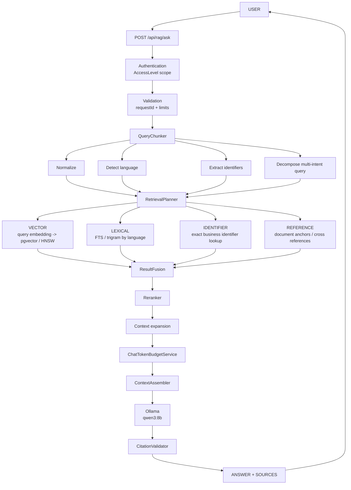
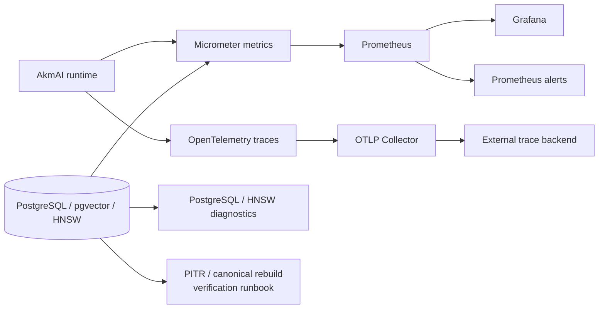

# akmai

Local multilingual RAG on Spring Boot + Spring AI + Ollama + PostgreSQL/pgvector.

## Goal

Akmai is a local-first RAG foundation for multilingual knowledge bases with a focus on:

- 11 target languages: Kazakh, Russian, English, Chinese, German, French, Spanish, Portuguese, Italian, Turkish and Greek;
- legal documents;
- medical documents;
- technical documentation.

Canonical model baseline:

- embeddings: `qwen3-embedding:4b`, fixed at `1024` dimensions;
- vector distance: cosine;
- ANN: HNSW;
- generation: `qwen3:8b`.

The embedding model and vector dimensionality form one canonical AkmAI embedding space. Runtime drift from `qwen3-embedding:4b / 1024` fails fast. Development, integration, stage and production quality paths use the same real embedding profile; unit tests may use deterministic test doubles where semantic quality is not under test.

The chunking pipeline remains independent from a concrete embedding space. A future encoder change is introduced only through a new versioned embedding profile, full generation re-embedding, quality validation and atomic publication. Vectors from different embedding profiles must never be mixed even when their dimensionality is identical.

## Architecture

AkmAI is not a direct `question -> LLM` wrapper. The system separates four cooperating flows:

1. **INGEST** — convert canonical documents into searchable lexical, vector, identifier and reference representations.
2. **RETRIEVE** — analyze a question and execute several retrieval strategies in parallel.
3. **GENERATE** — fuse and rerank evidence, build a bounded context and ask the local LLM to answer from that evidence.
4. **OPERATE** — observe latency, saturation, retention, PostgreSQL/HNSW health and support disaster recovery.

### System overview

```mermaid
flowchart LR
    CS["Canonical source<br/>legal / medical / technical documents"]

    subgraph ING["1. INGEST"]
        IAPI["Knowledge API"]
        AUTH["Security + AccessLevel"]
        LANG["Language canonicalization<br/>KK RU EN ZH DE FR ES PT IT TR EL"]
        NORM["TextNormalizer"]
        STRUCT["StructuralUnitExtractor"]
        SEM["DomainSemanticClassifier"]
        ATOM["AtomicUnitProtector"]
        CHUNK["SemanticChunker"]
        ENRICH["Identifiers + references<br/>structure + embedding text"]
        PAR["ParallelIngestionExecutor<br/>bounded backpressure"]
        EMB["Embedding batches"]
        PERSIST["PersistenceCoordinator"]

        IAPI --> AUTH --> LANG --> NORM --> STRUCT --> SEM --> ATOM --> CHUNK
        CHUNK --> ENRICH --> PAR
        PAR --> EMB
        PAR --> PERSIST
    end

    LIFE[("Lifecycle / generations<br/>PostgreSQL")]
    PROJ[("Search projections<br/>PostgreSQL")]
    VEC[("Vector storage<br/>pgvector / HNSW")]

    CS --> IAPI
    PERSIST --> LIFE
    PERSIST --> PROJ
    EMB --> VEC

    subgraph READ["2. RETRIEVE + 3. GENERATE"]
        Q["User question"]
        QAPI["RAG API"]
        QSEC["API key + AccessLevel scope"]
        QC["QueryChunker<br/>normalize / language / identifiers / decomposition"]
        PLAN["RetrievalPlanner"]
        VR["Vector retrieval"]
        LR["Lexical retrieval"]
        IR["Identifier retrieval"]
        RR["Reference retrieval"]
        FUSION["ResultFusion"]
        RERANK["Reranker"]
        EXPAND["Context expansion"]
        BUDGET["Token budget"]
        CTX["ContextAssembler"]
        LLM["Ollama / qwen3:8b"]
        CITE["Citation validation"]
        ANSWER["Answer + sources"]

        Q --> QAPI --> QSEC --> QC --> PLAN
        PLAN --> VR
        PLAN --> LR
        PLAN --> IR
        PLAN --> RR
        VR --> FUSION
        LR --> FUSION
        IR --> FUSION
        RR --> FUSION
        FUSION --> RERANK --> EXPAND --> BUDGET --> CTX --> LLM --> CITE --> ANSWER
    end

    VEC --> VR
    PROJ --> LR
    PROJ --> IR
    PROJ --> RR
    LIFE --> VR
    LIFE --> LR
```



The ingestion pipeline prepares the retrieval representation **before** a question arrives. A request therefore does not re-parse the source document: it searches already published, access-scoped retrieval data.

### How a question becomes an answer



| Stage | Responsibility | Why it exists |
|---|---|---|
| **Security / AccessLevel** | Resolves the caller's permitted access scope before retrieval. | Retrieval must never return evidence outside the caller's ACL. |
| **QueryChunker** | Normalizes the question, detects language, extracts exact identifiers and decomposes multi-intent questions. | Different parts of one question can require different retrieval strategies. |
| **Vector retrieval** | Embeds the semantic query and searches language/access-scoped HNSW leaves. | Finds semantically similar evidence even when wording differs. |
| **Lexical retrieval** | Uses PostgreSQL FTS and trigram search inside the requested language partition. | Preserves exact terminology and phrases that embeddings may underweight. |
| **Identifier retrieval** | Searches contract/document/order/etc. identifiers exactly. | Identifiers should not depend on vector similarity. |
| **Reference retrieval** | Follows structural references such as article/section relationships. | Legal and technical meaning often depends on referenced clauses. |
| **ResultFusion** | Combines independent ranked result sets. | Prevents one search channel from becoming the single source of truth. |
| **Reranker** | Reorders fused candidates against the actual question. | Improves relevance before context is sent to the LLM. |
| **Context expansion** | Adds bounded neighboring/related chunks. | A matching chunk may need nearby conditions, exceptions or definitions. |
| **Token budget** | Fits question, evidence and reserved answer tokens into the model context window. | Prevents context overflow and uncontrolled prompt growth. |
| **Ollama** | Generates the answer from the selected evidence. | The LLM synthesizes evidence; it is not used as the primary search engine. |
| **Citation validation** | Checks that returned citations refer to known retrieved evidence. | Keeps the final response tied to the retrieval result. |

### Operations plane

The request path is observed independently from the business flow:



The operations layer covers executor saturation, retrieval outcomes, retention/reconciliation state, HOT retrieval storage health, PostgreSQL/HNSW diagnostics, Prometheus/Grafana monitoring, OpenTelemetry export, a production container image and canonical-source disaster-recovery procedures.

The key design principle is:

```text
question
  -> analyze
  -> retrieve through multiple strategies
  -> enforce ACL/language routing
  -> fuse
  -> rerank
  -> build bounded evidence context
  -> generate locally with Ollama
  -> validate citations
  -> answer
```

## Semantic chunking rules

The first implementation protects meaning before token size.

Examples:

- legal rule + exception stay together when possible;
- legal obligation/prohibition/right markers are classified;
- medical indication + dosage can stay together;
- dosage + contraindication can stay together;
- section boundaries are treated as preferred chunk boundaries;
- cross references such as article/section/clause references are extracted;
- embedding text is enriched with document title, domain, language and section path.

Current token policy:

```text
target      750
soft max   1200
hard max   1800
minimum    250
```

These values are configurable under `akmai.chunking`.

## Local infrastructure

Start PostgreSQL + pgvector:

```bash
docker compose up -d postgres
```

Install Ollama models:

```bash
ollama pull qwen3-embedding:4b
ollama pull qwen3:8b
```

Run the application:

```bash
mvn spring-boot:run
```

## Ingest text

```http
POST /api/knowledge/text
Content-Type: application/json
```

Example:

```json
{
  "documentId": "law-001",
  "title": "Bank service agreement",
  "text": "Статья 25. Расторжение договора ...",
  "source": "agreement.md",
  "language": "ru",
  "domain": "LEGAL",
  "metadata": {
    "version": "2026-01"
  }
}
```

Response:

```json
{
  "documentId": "law-001",
  "chunkCount": 4
}
```

## Ask a question

```http
POST /api/rag/ask
Content-Type: application/json
```

```json
{
  "question": "Когда банк вправе расторгнуть договор?"
}
```

The generation prompt requires answers to remain grounded in retrieved context and asks the model not to omit legal/medical conditions, exceptions, contraindications or restrictions.

## Re-embedding strategy

AkmAI keeps a stable vector storage contract while versioning every embedding space. The current canonical profile is:

```text
provider     = Ollama
model        = qwen3-embedding:4b
dimensions   = 1024
distance     = COSINE_DISTANCE
index        = HNSW
```

A future encoder, instruction or embedding-text transformation is never mixed into the current space. The migration flow is:

```text
canonical KnowledgeChunk
        |
        v
new versioned EmbeddingProfile
        |
        v
full re-embedding into a new generation
        |
        v
retrieval quality + storage validation
        |
        v
atomic publication
        |
        v
old embedding generation retirement
```

Canonical documents, chunks and relations remain independent from the vector projection, so a future model upgrade does not require reparsing the original source documents. Equal dimensionality does not make vectors from different embedding profiles compatible.

## Next milestones

The core ingestion/retrieval architecture is already in place. The current production-readiness work focuses on:

1. complete the production operations hardening branch;
2. close alert delivery and centralized logging;
3. run 100k / 1M / 5M vector capacity benchmarks at 1024 dimensions;
4. run concurrent ingestion + retrieval + retention tests;
5. run live Ollama end-to-end capacity tests;
6. execute and record a canonical-source disaster-recovery rehearsal;
7. derive production SLOs, saturation thresholds and measured RTO from benchmark evidence.


## Business identifier index

Akmai extracts exact business identifiers independently from semantic embeddings.

Runtime-supported identifier types are derived from the registered `IdentifierParser` beans. The current supported set is:

- CONTRACT_NUMBER
- DOCUMENT_NUMBER
- ORDER_NUMBER
- INVOICE_NUMBER
- APPLICATION_NUMBER
- CASE_NUMBER

Other `IdentifierType` enum values are reserved for future parsers and are not advertised as runtime capabilities until a parser is registered.

The canonical model is:

```text
DocumentPage -> SemanticChunk -> IdentifierExtractor
                              -> DocumentIdentifier
                              -> PostgreSQL source of truth
                              -> IdentifierSearchIndex
```

Each identifier is addressed by `documentId + chunkId + pageNumber`. Values are normalized for exact lookup, while the raw value and surrounding context are retained.

`document_identifier` is range-partitioned by `created_at`. Partition creation is kept out of the ingestion hot path: a scheduler prepares the current and next two monthly partitions, while a DEFAULT partition provides a safety fallback.

The search layer is intentionally abstracted behind `IdentifierSearchIndex`. PostgreSQL is the initial implementation. A future local index such as Lucene can be rebuilt from the canonical PostgreSQL table without changing ingestion or the domain model.

Target mixed-query flow:

```text
"Какие штрафы в договоре KZ-2026-001847?"
          |
          +--> exact identifier lookup -> documentId
          |
          +--> semantic query "Какие штрафы?"
                         |
                         v
                 pgvector filtered by documentId
```


## AKMAI parallel pipeline

```text
             WRITE                       READ
               |                           |
               v                           v
            Document                    Question
               |                           |
               v                           v
        SemanticChunker              QueryChunker
               |                           |
               v                           v
       KnowledgeChunk[]               QueryChunk[]
               |                           |
               v                           v
 ParallelIngestionExecutor     ParallelRetrievalExecutor
               |                           |
       +-------+-------+           +-------+-------+
       v       v       v           v       v       v
      IDs     refs   vectors       IDs    vector lexical
       |       |       |           |       |       |
       +-------+-------+           +-------+-------+
               |                           |
               v                           v
     PersistenceCoordinator           ResultFusion
               |                           |
               v                           v
        Search projections             Reranker
                                           |
                                           v
                                    ContextAssembler
                                           |
                                           v
                                          Qwen
```

The same `IdentifierExtractor` and `IdentifierParser[]` rules are shared by WRITE and READ. Document chunks are enriched concurrently before persistence; questions are decomposed into independent query chunks and applicable retrieval strategies are executed concurrently. Both executors use bounded configurable thread pools rather than unbounded `parallelStream()`.

The production retrieval path combines vector, lexical, identifier and reference strategies, then applies result fusion, reranking, bounded context expansion and token budgeting before local answer generation. These stages remain separated behind dedicated components so storage, ranking and model implementations can evolve without coupling them directly to `RagQuestionService`.
