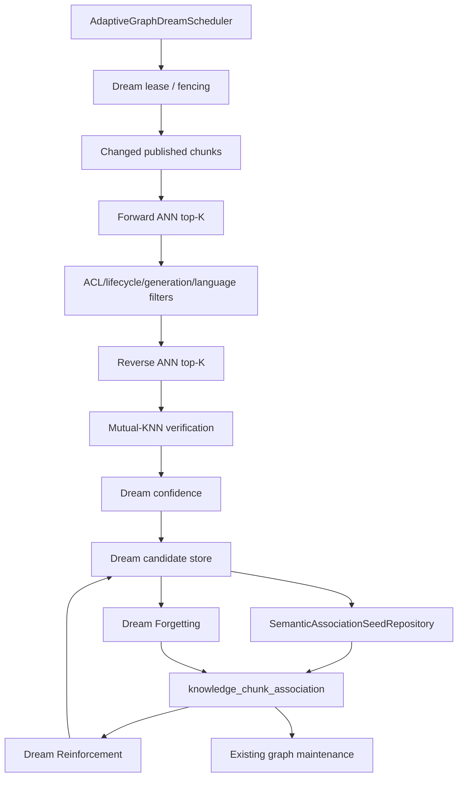

# Adaptive Graph Dream Cycle — design specification

Classification: **PROPOSED**  
Target branch: `feature/adaptive-graph-dream`  
Date: 2026-10-08

## 1. Purpose

The Adaptive Graph Dream Cycle is an offline consolidation subsystem for AkmAI's adaptive association graph. It runs outside the request path and periodically re-evaluates semantic neighbourhoods, strengthens validated semantic priors, and removes stale semantic-only relations.

The cycle is deliberately split into three bounded processes:

1. **Dream Expansion** — discover new high-confidence semantic candidates.
2. **Dream Reinforcement** — re-validate existing dream/semantic candidates and strengthen only their semantic evidence.
3. **Dream Forgetting** — weaken, deactivate or purge semantic-only relations that are no longer supported.

The Dream Cycle is not a new authoritative knowledge source and must not bypass the existing graph lifecycle, ACL boundary, generation boundary, published-lifecycle checks, context budget, citation validation or grounding.

## 2. Relationship to the current AkmAI graph

Current runtime responsibilities remain unchanged:

```text
ADAPTIVE_GRAPH_LEARNING_ENABLED
  -> online successful-answer evidence

ADAPTIVE_GRAPH_MAINTENANCE_ENABLED
  -> lifecycle scoring, hysteresis, quotas, decay, cleanup

ADAPTIVE_GRAPH_EXPANSION_ENABLED
  -> eligible graph neighbours may affect online retrieval
```

The new Dream Cycle adds an offline semantic-consolidation boundary:

```text
ADAPTIVE_GRAPH_DREAM_ENABLED
  -> run bounded offline consolidation
```

Important: Dream evidence is not equivalent to online user/query/citation evidence.

The existing `IngestionSemanticLinker` already performs ANN-based semantic seeding immediately after publication. Dream Expansion must therefore not duplicate ingestion linking. Its role is cross-time consolidation: re-scan changed/published chunks, verify reciprocal neighbourhood structure, and maintain semantic confidence after the initial ingestion event.

## 3. Safety invariant

A Dream observation must never fabricate online evidence.

Dream processing MUST NOT increment:

- `distinct_query_support`;
- `context_count`;
- `citation_count`;
- query-support sketches;
- any other counter representing successful user-request evidence.

Therefore a relation discovered only by semantic similarity cannot become HOT merely because the Dream scheduler sees it repeatedly.

The safe rule for v1 is:

```text
semantic/dream evidence -> candidate creation / semantic confidence / retention signal
online grounded evidence -> WARM/HOT promotion authority
```

This preserves the current authority model: semantic proximity can propose a relation, but successful grounded use must prove that the relation is useful for retrieval.

## 4. End-to-end architecture



Recommended process order in one cycle:

```text
Dream Expansion
    -> Dream Reinforcement
        -> Dream Forgetting
```

Each stage is independently bounded and observable. A failure in one stage must not corrupt the graph or cause the next scheduler run to restart an unbounded full-corpus scan.

## 5. Dream Expansion

### 5.1 Source set

Do not compare all chunks with all chunks.

The primary source set is:

```text
published chunks changed since the last successful dream watermark
```

A small bounded maintenance sample of old nodes may also be included so the graph can eventually adapt after embedding/profile/policy changes.

The algorithmic target is approximately:

```text
O(changed_chunks * K)
```

rather than:

```text
O(all_chunks^2)
```

### 5.2 Forward candidate search

For each source chunk `A`:

1. read its active embedding under the current embedding profile;
2. search the existing HNSW/vector index for `top-K(A)`;
3. reject self;
4. require the same ACL;
5. require currently published/ACTIVE generations;
6. apply the configured language policy;
7. reject candidates below the candidate threshold;
8. deduplicate by canonical pair.

Initial proposal:

```text
K = 32
candidate threshold = 0.88
```

These are calibration defaults, not release constants.

### 5.3 Mutual-KNN requirement

A candidate becomes eligible for strong Dream confidence only when the neighbourhood relation is reciprocal:

```text
B in top-K(A)
AND
A in top-K(B)
```

The reverse lookup is performed only for bounded forward candidates above the candidate threshold.

Reciprocal rank is retained because rank-1/rank-2 mutual neighbours are stronger evidence than rank-31/rank-32 mutual neighbours even when cosine scores are close.

### 5.4 Confidence model

The initial Dream confidence should use only semantic structural signals:

```text
forward_similarity
reverse_similarity
forward_rank
reverse_rank
mutual_knn
freshness/profile compatibility
```

A simple v1 model is intentionally explainable:

```text
similarity = min(forward_similarity, reverse_similarity)
rank_factor = 1 - ((max(forward_rank, reverse_rank) - 1) / K)

confidence =
    similarity * (0.85 + 0.15 * rank_factor)
```

If the relation is not mutual-KNN, it cannot cross the activation threshold in v1.

Future versions may add a reranker/NLI/semantic-grounding signal, but the first implementation should not introduce an additional model dependency into the nightly batch before the base mechanism is measured.

### 5.5 Activation

Proposed defaults:

```text
candidate_threshold = 0.88
activation_threshold = 0.94
max_new_edges_per_chunk = 3
```

An activated Dream candidate calls the existing symmetric semantic seeding boundary rather than writing graph rows ad hoc.

Conceptually:

```text
Dream candidate accepted
    -> SemanticAssociationSeedRepository.seedSymmetric(...)
    -> CANDIDATE graph relation / semantic prior
    -> existing graph maintenance remains authoritative
```

Dream Expansion MUST NOT directly create WARM or HOT associations.

## 6. Dream Reinforcement

Dream Reinforcement re-checks existing semantic/dream relations against the current embedding space.

It must distinguish two kinds of evidence:

```text
semantic evidence
online learned evidence
```

The process may update:

- forward/reverse semantic similarity;
- reciprocal ranks;
- Dream confidence;
- `semantic_last_seen_at` or an equivalent semantic timestamp;
- Dream positive/negative streaks;
- verification timestamps.

It must not increment user-derived learning counters.

### 6.1 Positive reinforcement

A relation receives positive Dream reinforcement when:

```text
mutual_knn = true
AND confidence >= activation_threshold
AND both nodes remain published/ACTIVE
AND ACL/generation invariants still hold
```

Repeated Dream confirmation can keep semantic metadata current and make the candidate more reliable for future online evidence, but cannot independently satisfy WARM/HOT online evidence gates.

### 6.2 Hysteresis

Dream state should not flap near one threshold.

Recommended semantic hysteresis:

```text
activate at >= 0.94
remain active while >= 0.90
candidate below 0.90
forgetting pressure below 0.86
```

Exact values require corpus calibration.

## 7. Dream Forgetting

Dream Forgetting is not a duplicate of `AdaptiveGraphMaintenanceService`.

Existing maintenance already decays learned graph weight using successful-evidence freshness and handles CANDIDATE/WARM/HOT/DECAYED lifecycle transitions.

Dream Forgetting has a narrower responsibility: semantic invalidation.

A relation accumulates forgetting pressure when one or more conditions hold:

- it is no longer mutual-KNN;
- similarity drops below the semantic retention threshold;
- one node is no longer published/ACTIVE;
- generation identity is obsolete;
- the embedding/profile policy is incompatible with the stored observation;
- repeated verification runs fail to rediscover the relation.

### 7.1 Never destroy learned evidence just because semantics changed

If a relation has real online evidence, Dream Forgetting must not erase that evidence.

Example:

```text
semantic relation no longer mutual-KNN
but citation_count > 0 / distinct_query_support > 0
```

Action:

```text
clear/degrade semantic prior
retain learned counters
let existing maintenance decide lifecycle from learned evidence
```

### 7.2 Semantic-only relation

If a relation was semantic-only and has never gained online evidence, repeated negative Dream verification may mark the semantic candidate stale and allow the graph row to decay/purge.

Recommended rule:

```text
negative_streak >= 3
AND no online learned evidence
AND confidence < forgetting_threshold
    -> semantic relation eligible for decay/removal
```

This avoids deleting a useful relation after one approximate ANN miss.

## 8. Degree control and hub prevention

Dream Expansion must have a stricter creation budget than the total graph quota.

Recommended default:

```text
max_new_edges_per_chunk = 3
```

Allowed configuration range:

```text
1..5 for normal production use
```

The existing graph quotas remain the hard lifecycle/store bounds.

The Dream budget specifically prevents generic chunks such as:

```text
"For more information ..."
```

from becoming semantic hubs solely because they are close to many chunks.

Additional hub controls:

- mutual-KNN is mandatory for activation;
- canonical pair deduplication;
- per-run source budget;
- per-node semantic degree cap;
- generic/high-frequency chunk suppression may be added later from measured data;
- no multi-hop Dream expansion in v1.

## 9. Proposed configuration contract

Repository convention uses `AKMAI_...` environment variables and `akmai.*` Spring/runtime keys.

Proposed application configuration:

```yaml
akmai:
  adaptive-graph:
    dream-enabled: ${AKMAI_ADAPTIVE_GRAPH_DREAM_ENABLED:false}
    dream:
      apply-enabled: ${AKMAI_ADAPTIVE_GRAPH_DREAM_APPLY_ENABLED:false}
      cron: ${AKMAI_ADAPTIVE_GRAPH_DREAM_CRON:0 0 3 * * *}
      zone: ${AKMAI_ADAPTIVE_GRAPH_DREAM_ZONE:UTC}
      top-k: ${AKMAI_ADAPTIVE_GRAPH_DREAM_TOP_K:32}
      candidate-threshold: ${AKMAI_ADAPTIVE_GRAPH_DREAM_CANDIDATE_THRESHOLD:0.88}
      activation-threshold: ${AKMAI_ADAPTIVE_GRAPH_DREAM_ACTIVATION_THRESHOLD:0.94}
      retention-threshold: ${AKMAI_ADAPTIVE_GRAPH_DREAM_RETENTION_THRESHOLD:0.90}
      forgetting-threshold: ${AKMAI_ADAPTIVE_GRAPH_DREAM_FORGETTING_THRESHOLD:0.86}
      max-new-edges-per-chunk: ${AKMAI_ADAPTIVE_GRAPH_DREAM_MAX_NEW_EDGES_PER_CHUNK:3}
      max-sources-per-run: ${AKMAI_ADAPTIVE_GRAPH_DREAM_MAX_SOURCES_PER_RUN:10000}
      batch-size: ${AKMAI_ADAPTIVE_GRAPH_DREAM_BATCH_SIZE:200}
      negative-streak-for-forgetting: ${AKMAI_ADAPTIVE_GRAPH_DREAM_NEGATIVE_STREAK:3}
      decay-enabled: ${AKMAI_ADAPTIVE_GRAPH_DREAM_DECAY_ENABLED:true}
```

Runtime switches to add to `AppParameterKey`:

```text
ADAPTIVE_GRAPH_DREAM_ENABLED
  -> akmai.adaptive-graph.dream-enabled

ADAPTIVE_GRAPH_DREAM_APPLY_ENABLED
  -> akmai.adaptive-graph.dream.apply-enabled
```

`DREAM_ENABLED=true` with `DREAM_APPLY_ENABLED=false` is shadow mode: discovery and metrics run, but graph relations are not changed.

This is the mandatory first rollout mode.

## 10. Configuration validation

The proposed `AdaptiveGraphProperties.Dream` record should fail fast when:

- `topK` is outside `[2, 256]`;
- thresholds are outside `[0, 1]`;
- `forgetting < retention < activation` is not satisfied;
- `candidateThreshold > activationThreshold`;
- `maxNewEdgesPerChunk` is outside `[1, 16]`;
- batch/source budgets are non-positive;
- negative streak is less than `2`;
- cron/zone cannot be parsed.

Recommended stricter invariant:

```text
candidate_threshold <= forgetting_threshold
< retention_threshold
< activation_threshold
```

If later calibration shows a different candidate/forgetting relationship is useful, the invariant can be relaxed with explicit tests.

## 11. Persistence model

Do not overload online learning counters with Dream state.

Recommended new canonical table:

```text
knowledge_chunk_dream_candidate
```

One row represents one undirected pair, normalized by node ordering.

Proposed columns:

```text
access_level
node_a_document_id
node_a_generation
node_a_chunk_id
node_b_document_id
node_b_generation
node_b_chunk_id
graph_version
semantic_policy_version

state                 CANDIDATE | ACTIVE | STALE | REJECTED
forward_similarity
reverse_similarity
forward_rank
reverse_rank
mutual_knn
confidence
positive_streak
negative_streak
first_seen_at
last_seen_at
last_verified_at
activated_at
updated_at
```

Primary key:

```text
(access_level,
 node_a_document_id, node_a_generation, node_a_chunk_id,
 node_b_document_id, node_b_generation, node_b_chunk_id,
 graph_version, semantic_policy_version)
```

Why a canonical table instead of adding all fields to `knowledge_chunk_association`:

- graph associations are physically stored as two directed rows;
- Dream evidence is logically undirected;
- one canonical row avoids reciprocal metadata divergence;
- Dream state remains disposable and auditable;
- online graph schema remains focused on retrieval/lifecycle data.

Accepted candidates still seed/update the existing `knowledge_chunk_association` through its repository boundary.

## 12. Watermark and resumability

A Dream run must be resumable.

Persist a checkpoint containing at least:

```text
semantic_policy_version
last_successful_source_watermark
last_completed_at
```

Source enumeration should use stable keyset pagination, not OFFSET pagination.

The cursor should be deterministic, for example:

```text
(updated_at, access_level, document_id, generation, chunk_id)
```

If the process crashes after batch N, the next run resumes without scanning the full corpus.

A periodic bounded rescan lane may separately sample older nodes to detect neighbourhood changes that are not caused by the source node itself changing.

## 13. Multi-replica scheduler safety

`@Scheduled` alone is insufficient in a multi-replica deployment because every application replica may execute the same nightly job.

Dream execution therefore requires a cluster-wide lease with fencing.

Recommended implementation follows the existing AkmAI re-embedding ownership pattern:

```text
owner_id
lease_until
fencing_token
```

Requirements:

- only the current owner may advance the Dream watermark;
- stale owners cannot apply candidates after lease loss;
- lease renewal happens between bounded batches;
- apply operations carry the current fencing token;
- a failed replica can be taken over after lease expiry.

## 14. Semantic policy/versioning

Dream results depend on more than graph version. They depend on the active embedding profile, dimensions, distance semantics, language policy, K and scoring thresholds.

Define a `semantic_policy_version` or equivalent deterministic fingerprint.

At minimum it must change when any of these materially change:

- embedding model/profile;
- vector dimensions/distance type;
- same-language policy;
- top-K policy;
- Dream confidence formula.

Old Dream evidence must not silently be treated as current evidence after an embedding-space change.

## 15. Lifecycle and retention boundary

Every Dream read and apply operation must re-check current publication/lifecycle eligibility.

The invariant is the same as online retrieval:

```text
lifecycle_status = READY
retention_status = ACTIVE
published_generation = node.generation
TTL not expired
```

A candidate that was valid at ANN discovery time may become invalid before apply; apply therefore requires a final transactional revalidation.

Cross-ACL edges remain forbidden:

```text
A.access_level == B.access_level == edge.access_level
```

## 16. Language policy

The current ingestion semantic linker defaults to same-language-only linking.

Dream v1 should preserve that behavior by default rather than silently creating cross-language semantic relations.

Cross-language Dream linking should be a separately evaluated feature because multilingual embedding closeness is model-dependent and may have different false-positive characteristics for RU/KK/EN.

## 17. Shadow-first rollout

Required rollout sequence:

```text
Phase D0
  dream-enabled=false
  dream.apply-enabled=false

Phase D1
  dream-enabled=true
  dream.apply-enabled=false
  -> shadow discovery only

Phase D2
  compare candidate precision, reciprocal rate, degree distribution
  tune K / thresholds / per-node budget

Phase D3
  dream.apply-enabled=true
  graph expansion still disabled
  -> create semantic CANDIDATE relations only

Phase D4
  maintenance enabled
  shadow graph expansion enabled
  online graph expansion disabled

Phase D5
  replay/statistical evaluation

Phase D6
  canary online graph expansion

Phase D7
  broader enablement only after measured lift
```

Never enable Dream apply and online graph expansion simultaneously on an uncalibrated empty deployment.

## 18. Metrics

At minimum expose:

```text
adaptive_graph_dream_runs_total{phase,outcome}
adaptive_graph_dream_duration_seconds{phase}
adaptive_graph_dream_sources_total{phase}
adaptive_graph_dream_candidates_total{state}
adaptive_graph_dream_mutual_knn_total{result}
adaptive_graph_dream_edges_applied_total
aadaptive_graph_dream_edges_rejected_total{reason}
adaptive_graph_dream_edges_forgotten_total{reason}
adaptive_graph_dream_confidence_histogram
adaptive_graph_dream_degree_rejected_total
adaptive_graph_dream_lease_events_total{event}
```

Implementation should use the correctly spelled metric prefix; the doubled `a` above is not part of the contract and must not be implemented.

Operational dashboards should track:

- mutual-KNN acceptance ratio;
- candidate -> activated ratio;
- activated -> later online-evidence ratio;
- semantic-only edge survival time;
- p50/p95/p99 Dream batch duration;
- HNSW queries per run;
- DB rows touched per run;
- max/median semantic degree;
- hub distribution / high-degree outliers;
- Dream candidate citation rate after eventual online use;
- retrieval/grounding delta once online expansion is canaried.

## 19. Resource limits

Dream is an offline process but must still be production-safe.

Hard limits:

- bounded source count per run;
- bounded batch size;
- bounded top-K;
- bounded reverse checks;
- bounded new edges per source;
- transaction timeout;
- query timeout;
- lease duration/renewal;
- no unbounded in-memory candidate accumulation.

The scheduler should yield between batches if database saturation or application shutdown is detected.

Dream must not compete aggressively with interactive retrieval traffic. Long term, run-time admission can consult DB saturation/queue metrics, but v1 can start with conservative batch/query limits and a low-traffic cron window.

## 20. Proposed classes

```text
config/
  AdaptiveGraphProperties.Dream

knowledge/graph/dream/
  AdaptiveGraphDreamScheduler
  AdaptiveGraphDreamCoordinator
  AdaptiveGraphDreamLeaseManager
  AdaptiveGraphDreamSourceRepository
  AdaptiveGraphDreamCandidateRepository
  DreamExpansionService
  DreamReinforcementService
  DreamForgettingService
  DreamConfidenceCalculator
  DreamSemanticPolicy
  DreamRunReport
```

Existing components to reuse rather than duplicate:

```text
SemanticNeighborSearchRepository
SemanticAssociationSeedRepository
ChunkGraphNode
AdaptiveGraphMaintenanceService
AppParameterService
AkmaiMetrics
published lifecycle/projection eligibility boundaries
embedding profile metadata
```

## 21. Test plan

### Unit tests

- mutual-KNN accepted;
- one-way KNN rejected for activation;
- confidence monotonic with similarity/rank;
- hysteresis around activation/retention/forgetting thresholds;
- degree cap enforced;
- Dream cannot increment query/context/citation evidence;
- learned edge survives semantic forgetting;
- semantic-only edge becomes stale after required negative streak;
- configuration invariants fail fast.

### PostgreSQL/Testcontainers integration

- HNSW forward + reverse search produces expected mutual pair;
- cross-ACL candidate impossible;
- unpublished/expired generation rejected before apply;
- publication race rejected by final transactional revalidation;
- symmetric graph seed remains consistent;
- canonical Dream pair is unique under concurrent discovery;
- multi-replica lease has one owner;
- stale fencing token cannot apply after takeover;
- watermark resumes after interrupted run;
- degree cap remains correct under concurrency.

### Statistical/replay acceptance

Use a human-reviewed corpus with positive and hard-negative semantic pairs.

Measure:

```text
precision@activated-dream-edge
false-link rate
mutual-KNN rate
hub/degree distribution
candidate -> online-useful conversion
retrieval recall delta
MRR/nDCG delta
grounded-answer delta
citation coverage delta
latency/resource delta
```

Initial release gate should favor precision over recall. The Dream subsystem is optional; missing a useful edge is safer than creating a false high-confidence relation.

## 22. Definition of done

The first Dream implementation is complete only when all of the following are true:

1. Dream scheduler is cluster-safe and resumable.
2. Expansion uses changed-source bounded ANN search, not all-pairs comparison.
3. Activation requires mutual-KNN.
4. ACL, generation and published lifecycle invariants are enforced at discovery and apply.
5. Dream state is separated from online user-derived evidence.
6. Dream cannot promote an edge directly to WARM/HOT.
7. Reinforcement updates semantic evidence only.
8. Forgetting never erases valid learned evidence.
9. Degree limits prevent semantic hubs.
10. Shadow mode is the default and apply mode defaults to false.
11. Metrics expose candidate precision proxies, degree distribution and resource cost.
12. PostgreSQL concurrency/lifecycle/lease tests are green.
13. Replay evaluation demonstrates acceptable false-link rate before apply mode is enabled.
14. Online expansion remains separately gated and canaried.

## 23. Recommended implementation order

```text
DREAM-1  configuration + runtime flags + validation
DREAM-2  canonical candidate schema + repositories
DREAM-3  lease/fencing + watermark
DREAM-4  Expansion + forward/reverse mutual-KNN
DREAM-5  shadow telemetry
DREAM-6  apply through SemanticAssociationSeedRepository
DREAM-7  Reinforcement
DREAM-8  Forgetting
DREAM-9  Testcontainers concurrency/lifecycle acceptance
DREAM-10 replay/calibration harness
DREAM-11 canary integration with graph shadow expansion
```

Do not begin by changing online retrieval ranking. First establish that the Dream cycle proposes high-precision, bounded, stable associations under shadow evaluation.

## 24. Key design decision

The most important boundary is:

> Dreaming may propose and semantically validate memory, but only grounded online evidence may prove retrieval utility.

That separation prevents the system from converting embedding similarity into self-reinforcing factual confidence while still allowing AkmAI to consolidate useful associations during low-traffic offline windows.
