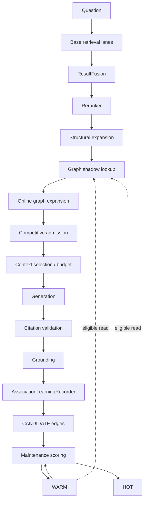

# Adaptive Association Graph — current runtime contract

Classification: **CURRENT**  
Synchronized against: `main@33ebbe469d994fe60c227972b1d7f730ce6cf0ba`  
Date: 2026-10-08

This document explains what the Adaptive Association Graph actually does in the current AkmAI runtime, when it learns, when it can influence an answer, and which boundaries it must never cross.

## 1. What the graph is

The Adaptive Association Graph is **derived retrieval memory**. It learns bounded associations between chunks that repeatedly prove useful together in grounded answers.

It is not:

- a source of authoritative domain facts;
- a replacement for explicit document references;
- an ontology store;
- a peer RRF retrieval lane;
- an unrestricted graph-reasoning engine;
- a mechanism allowed to cross ACLs or silently migrate across document generations.

The graph must be disposable. AkmAI must remain correct if all adaptive associations are lost; retrieval quality may degrade, but factual authority must not.

## 2. Node and edge identity

A node is generation- and ACL-aware:

```text
(access_level, document_id, generation, chunk_id)
```

A learned logical association is symmetric:

```text
A <-> B
```

For efficient adjacency reads it is physically represented as directed rows in PostgreSQL while preserving symmetric update invariants.

The main storage family is `knowledge_chunk_association`, introduced by Liquibase and partitioned first by `access_level`, then by a bounded source-identity hash layout.

## 3. The three graph feature boundaries

The three central runtime switches have deliberately different responsibilities.

### `ADAPTIVE_GRAPH_LEARNING_ENABLED`

**Write path.** Allows successful answer evidence to create or reinforce candidate associations.

Learning does not make a candidate immediately eligible for online expansion.

### `ADAPTIVE_GRAPH_MAINTENANCE_ENABLED`

**Lifecycle path.** Periodically rescales/decays evidence, moves associations across lifecycle bands, enforces degree quotas and purges stale relations.

Maintenance does not directly add evidence to a user request.

### `ADAPTIVE_GRAPH_EXPANSION_ENABLED`

**Read path.** Allows eligible WARM/HOT graph neighbours to be converted back into published retrieval hits and enter the current request's candidate pool.

This is the switch that can directly change final context and therefore potentially change an answer.

## 4. Related switches

The current configuration also separates:

- `ADAPTIVE_GRAPH_SHADOW_EXPANSION_ENABLED` — evaluate what graph expansion would add without necessarily using those candidates online;
- adaptive graph competition enablement — controls whether graph candidates may competitively displace lower-value unprotected candidates;
- graph version — isolates edge generations/policy versions;
- learning, scoring, maintenance, quota and adjacency thresholds.

All graph behavior defaults to **disabled** in the repository configuration unless explicitly enabled by environment/runtime parameters.

## 5. End-to-end feedback loop



## 6. When learning happens

Association learning is downstream of answer quality gates. A raw retrieval co-occurrence is not enough.

The current learning recorder receives:

- query chunks;
- allowed access levels;
- the bounded final context;
- citation validation output.

A pair is eligible only when the relevant hits:

- have routing identity;
- are inside the caller's allowed ACL set;
- belong to the same ACL for that pair;
- are not `RetrievalType.GRAPH` learning sources;
- include at least one cited chunk in the pair;
- fit configured per-request context/pair bounds.

Graph-origin candidates are explicitly excluded from normal pair formation. This prevents the simplest self-reinforcing loop:

```text
GRAPH adds B
  -> B appears in context
  -> graph learns B only because graph added B
  -> B gets stronger forever
```

## 7. Learning evidence

Current association evidence tracks bounded counters/signals including:

- context co-use;
- citation co-use;
- distinct privacy-safe query support;
- timestamps/freshness;
- graph version.

The privacy-safe query fingerprint maps requests into bounded support buckets; the raw question does not need to become edge identity.

The learning recorder limits both the number of context chunks considered and the number of emitted pairs per request.

## 8. Lifecycle bands

Associations move through bounded lifecycle bands:

```text
CANDIDATE -> WARM -> HOT
     |         |      |
     |         |      +---- decay -> WARM
     |         +----------- decay -> CANDIDATE
     +--------------------- TTL -> DECAYED -> purge
```

Current default thresholds from `application.yml`:

| Parameter | Default |
|---|---:|
| promote WARM | `0.35` |
| demote WARM | `0.20` |
| promote HOT | `0.65` |
| demote HOT | `0.50` |
| minimum distinct query support WARM | `2` |
| minimum distinct query support HOT | `4` |
| minimum citation count HOT | `1` |
| score half-life | `30d` |
| rescore interval | `1h` |
| candidate TTL | `30d` |
| decayed TTL | `14d` |
| maintenance fixed delay | `5m` |

The lifecycle uses hysteresis so relations do not oscillate around one threshold.

## 9. Score model

The current score calculator uses saturating evidence terms and freshness decay.

Conceptually:

```text
distinct = 1 - exp(-distinct_query_support / distinct_query_scale)
context  = 1 - exp(-context_count / context_scale)
citation = 1 - exp(-citation_count / citation_scale)

evidence = weighted_average(distinct, context, citation)
freshness = 0.5 ^ (age / half_life)
effective_weight = clamp(evidence * freshness, 0, 1)
```

Current default evidence weights:

```text
distinct query  0.45
context         0.20
citation        0.35
```

Current default scales:

```text
distinct query  4.0
context         4.0
citation        2.0
```

## 10. Rough time-to-influence

The graph is not governed by total request count. It is governed by **repeated successful evidence for a particular chunk pair**, query diversity, maintenance and feature enablement.

With the current defaults and fresh evidence:

- one successful observation normally creates/reinforces a `CANDIDATE`;
- around two distinct successful observations can be enough for `CANDIDATE -> WARM` if the score threshold is met;
- after the next maintenance cycle, WARM may become eligible for online lookup;
- around four distinct successful observations plus citation evidence can satisfy the minimum HOT gates, subject to score and maintenance transitions.

Because maintenance is asynchronous, the practical lower bound for first online influence is approximately:

```text
2 suitable distinct grounded observations
+ next successful maintenance cycle
+ online expansion enabled
+ a later query that finds one side as a strong seed
```

With default feature flags unchanged (`false`), the graph will influence **zero answers regardless of request count**.

## 11. Online lookup boundary

The current expansion implementation performs bounded **one-hop** lookup from selected strong seeds.

It reads:

- HOT neighbours above the configured HOT minimum weight;
- optionally a bounded number of WARM neighbours above the configured WARM minimum weight.

Current adjacency defaults include:

| Parameter | Default |
|---|---:|
| max seeds | `4` |
| HOT neighbours per seed | `4` |
| WARM neighbours per seed | `2` |
| max graph candidates | `12` |
| minimum seed strength | `0.25` |
| minimum HOT edge weight | `0.50` |
| minimum WARM edge weight | `0.30` |
| HOT band factor | `1.0` |
| WARM band factor | `0.70` |

The graph does not perform arbitrary multi-hop traversal in v1.

## 12. Seed strength

Seeds come from already ranked evidence. Exact/high-authority evidence may receive full seed strength; otherwise seed strength is derived from rerank/fused evidence and normalized to a bounded value.

This ensures the graph expands from evidence the base system already considers strong rather than functioning as an unconstrained graph-only retriever.

## 13. Candidate scoring

A graph candidate's contribution is approximately:

```text
seed_strength * edge_weight * band_factor
```

When multiple seeds reach the same target, contributions are combined with a bounded probabilistic-union style accumulator rather than unbounded summation. This reduces hub/popularity explosion.

## 14. Canonical revalidation

The graph never returns stored text as authoritative payload. A graph neighbour is re-resolved through the published search projection under the current ACL/lifecycle context before becoming a `RetrievalHit`.

Online hits are tagged as:

```text
RetrievalType.GRAPH
authorityTier = 4
expansion = adaptive_graph
adaptiveGraphScore = ...
adaptiveGraphBand = WARM|HOT
adaptiveGraphVersion = ...
```

## 15. ACL boundary

ACL is both a logical and physical graph boundary.

Invariant:

```text
source.access_level == target.access_level == edge.access_level
```

No learned relation may bridge two access levels.

All reads require an allowed-access-level set, and storage is partitioned by `access_level` before source hashing.

## 16. Generation boundary

The graph never assumes a stable `chunk_id` means stable content across document generations.

```text
doc-A/gen-1/chunk-5 != doc-A/gen-2/chunk-5
```

A new published generation produces distinct graph node identities. Learned associations from an old generation are not silently copied into the new generation.

## 17. Authority boundary

The graph is intentionally lower authority than explicit/document-derived evidence.

Conceptual ordering:

```text
Tier 0  exact identifier / explicit reference
Tier 1  reserved verified domain evidence
Tier 2  vector / lexical / concept fused evidence
Tier 3  structural adjacency
Tier 4  learned adaptive association
```

Frequency of use increases confidence that a relation is useful for retrieval; it never turns popularity into factual truth.

## 18. Context/token boundary

Graph candidates still pass through the same downstream bounds:

- competitive admission;
- authority/lifecycle filtering;
- parent expansion/diversity controls;
- context chunk limits;
- token budget;
- final published-context revalidation;
- citation validation;
- grounding.

Therefore enabling graph expansion does not grant unlimited context growth.

## 19. Degree and storage bounds

Current default per-source band quotas:

```text
HOT        8
WARM       8
CANDIDATE 16
```

The schema v1 storage contract uses `32` source hash buckets per ACL partition.

These are capacity controls, not statements of semantic truth. They should be changed only through measurement/calibration evidence.

## 20. Recommended rollout

Do not jump from empty graph to fully enabled online influence.

Recommended sequence:

```text
Phase 0  all graph switches off
Phase 1  learning=true, maintenance=false, expansion=false
Phase 2  learning=true, maintenance=true, expansion=false
Phase 3  shadow-expansion=true, expansion=false
Phase 4  replay/statistical evaluation and threshold calibration
Phase 5  controlled online expansion
Phase 6  competition/canary with CONTROL cohort
Phase 7  broader enablement after measured lift
```

A practical safe learning phase is:

```text
learning=true
maintenance=true
shadow-expansion=true
expansion=false
```

This lets the graph mature and exposes `would_add` telemetry without changing user answers.

## 21. What to measure before online enablement

Do not judge the graph by edge count or HOT count alone.

Primary quality metrics should include:

- delta grounded-answer rate;
- delta evidence recall;
- delta citation recall/coverage;
- delta abstention rate;
- graph-candidate citation rate;
- graph-candidate downstream survival rate;
- context-token delta;
- p95/p99 latency delta;
- contradiction/regression rate;
- graph lookup and expansion failure rate.

## 22. Next recommended learning improvement

The current model mainly learns from successful co-context/citation evidence. The next useful evolution is **incremental edge utility**, not deeper graph traversal.

Recommended additional edge signals:

```text
positive:
  incremental grounding lift
  incremental citation/evidence coverage lift
  query diversity
  structural prior
  semantic compatibility

negative:
  repeated exposure without selection/citation
  redundancy/context-cost penalty
  contradiction penalty
  authority conflict penalty
```

A future utility record can track, per learned relation:

```text
times_admitted
times_selected
times_cited
times_grounded
times_contradicted
average_context_cost
estimated_incremental_quality_lift
```

These should refine learned retrieval utility without converting the adaptive graph into authoritative knowledge.

## 23. PostgreSQL vs dedicated graph database

A dedicated graph engine is intentionally unnecessary for the current workload. AkmAI v1 needs bounded one-hop adjacency reads, lifecycle scoring and maintenance, all of which fit the existing PostgreSQL operational model.

Revisit a graph database only if measured requirements introduce substantial arbitrary multi-hop traversal, path analytics, centrality/community algorithms or graph workloads that no longer map efficiently to bounded indexed adjacency reads.

## 24. Related documents

- [`adaptive-chunk-graph.md`](adaptive-chunk-graph.md) — original graph architecture and invariants.
- [`adaptive-chunk-graph-calibration.md`](adaptive-chunk-graph-calibration.md) — calibration methodology.
- [`adaptive-chunk-graph-rollout.md`](adaptive-chunk-graph-rollout.md) — rollout/recovery contract.
- [`adaptive-graph-learning-replay.md`](adaptive-graph-learning-replay.md) — replay evaluation.
- [`adaptive-memory-statistical-evaluation.md`](adaptive-memory-statistical-evaluation.md) — statistical acceptance.
- [`current-runtime-architecture.md`](current-runtime-architecture.md) — full runtime path.
