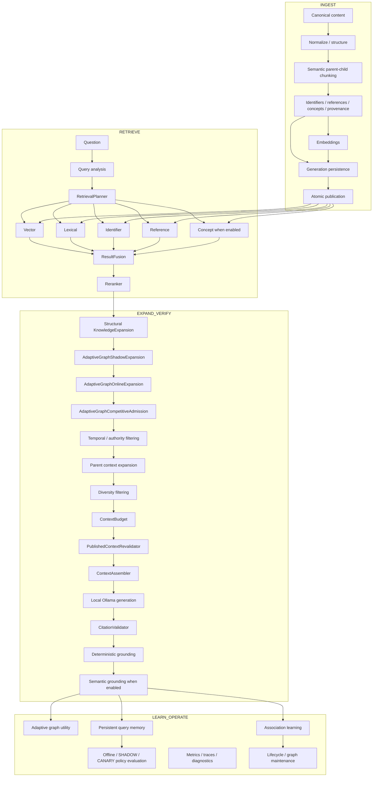

# AkmAI current runtime architecture

Classification: **CURRENT**  
Synchronized against: `main@33ebbe469d994fe60c227972b1d7f730ce6cf0ba`  
Date: 2026-10-08

This document describes the executable AkmAI runtime at a system level. Design documents in this directory provide deeper rationale; this file is the current-state map.

## 1. System purpose

AkmAI is a local-first multilingual evidence RAG engine for legal, medical and technical knowledge bases. It is designed around retrieval correctness, ACL isolation, lifecycle safety, provenance, citations, grounding, local model execution and bounded self-optimization.

The system is not a direct `question -> LLM` wrapper. The LLM is the final synthesis stage over evidence selected by retrieval and verification components.

## 2. Runtime planes

AkmAI has five cooperating planes:

1. **INGEST** — canonicalize, structure, chunk, enrich, embed and publish knowledge.
2. **RETRIEVE** — analyze a query and execute applicable retrieval lanes under ACL/lifecycle constraints.
3. **GENERATE** — fuse, rerank, expand and budget evidence before local generation.
4. **VERIFY** — validate citations and grounding before accepting an answer.
5. **LEARN / OPERATE** — collect bounded observations, maintain adaptive memory, evaluate policies and operate the service.



## 3. Ingest path

The ingest path converts source content into a generation-scoped, access-scoped searchable representation.

Core responsibilities:

- normalize text while preserving semantic structure;
- extract structural units and section paths;
- apply domain-aware semantic classification;
- protect atomic legal/medical/technical units from unsafe splitting;
- produce parent/child semantic chunks within configured token budgets;
- extract exact business identifiers and document references;
- attach provenance and semantic metadata;
- generate embeddings using the active embedding profile;
- persist generation payloads;
- publish a complete generation atomically.

The active embedding profile is versioned. AkmAI must not mix embeddings from different profiles even when vector dimensionality is the same.

## 4. Retrieval lanes

The production pipeline supports independent retrieval evidence sources:

- **VECTOR** — semantic similarity in pgvector/HNSW;
- **LEXICAL** — PostgreSQL text/trigram retrieval;
- **IDENTIFIER** — exact business identifier lookup;
- **REFERENCE** — explicit document-reference/anchor relationships;
- **CONCEPT** — semantic concept retrieval when enabled by the active configuration/policy.

These lanes have different authority semantics. Exact identifiers and explicit references are not merely high-scoring vector hits.

The Adaptive Association Graph is deliberately **not** a fifth peer RRF lane. It is a bounded post-rerank expansion/memory layer. See [`adaptive-graph-runtime.md`](adaptive-graph-runtime.md).

## 5. Retrieval flow

```text
Question
  -> QueryChunker / query analysis
  -> RetrievalPlanner
  -> applicable retrieval lanes
  -> ResultFusion
  -> Reranker
  -> structural KnowledgeExpansion
  -> adaptive graph observation/online expansion when enabled
  -> competitive admission
  -> authority/lifecycle filtering
  -> parent expansion
  -> diversity filtering
  -> context budget
  -> final published-context revalidation
```

Important invariants:

- ACL is applied before and during retrieval; it is not a late redaction step.
- A retrieval hit must correspond to an eligible published generation before entering final context.
- TTL expiry is synchronously fenced even if asynchronous retention cleanup has not run yet.
- Final context is revalidated after expansion/budgeting to protect against lifecycle changes during the request.

## 6. Generation and verification

Generation receives only bounded evidence assembled from the final context.

```text
final evidence
  -> ContextAssembler
  -> local LLM
  -> CitationValidator
  -> deterministic grounding
  -> optional semantic claim/evidence verification
  -> answer or insufficient-information response
```

A generated answer is not accepted solely because the model returned text. Invalid citations or failed grounding cause the request to fail closed to an insufficient-information result.

## 7. Adaptive Association Graph

The graph is derived retrieval memory over generation-aware chunk identities.

Node identity:

```text
(access_level, document_id, generation, chunk_id)
```

Edge lifecycle:

```text
CANDIDATE -> WARM -> HOT
     |         |      |
     +--decay--+--decay
          -> DECAYED -> purge
```

Current default graph feature switches are off. Enabling learning does not itself enable online influence. Learning, maintenance, shadow expansion, online expansion and competition are separately controlled.

The graph performs bounded one-hop adjacency lookup in PostgreSQL; v1 does not require a dedicated graph database.

## 8. Self-optimizing RAG

AkmAI self-optimization changes retrieval behavior, not authoritative knowledge.

The safe promotion model is:

```text
MEASURE
  -> build candidate policy/memory
  -> OFFLINE evaluate
  -> SHADOW
  -> CANARY + CONTROL
  -> APPROVE or ROLLBACK
  -> continue measurement
```

Persistent Query Memory and learning events are namespaced and bounded. Query/source fingerprints are privacy-safe and do not require retaining raw user identity.

## 9. Storage model

Primary runtime storage is PostgreSQL with pgvector.

Major data classes include:

- canonical generation/lifecycle records;
- published search projections;
- vector payload/manifests;
- identifiers;
- explicit reference edges;
- adaptive chunk associations;
- self-optimizing/query-memory state;
- audit/runtime parameter state.

Executable schema truth is in Liquibase migrations under `src/main/resources/db/changelog`.

## 10. Lifecycle and retention

Document generations are first-class runtime identities. Re-ingesting a document creates a new generation; old graph/vector/reference state does not silently become the new generation's state.

Retirement/purge must account for all generation payload families, including adaptive associations. Reconciliation and repair verify residual payload rather than assuming cleanup succeeded.

## 11. Security boundaries

Security is intentionally coupled to retrieval routing:

- access levels scope retrieval and graph reads/writes;
- learned graph edges never cross ACL boundaries;
- non-local deployments fail startup for unsafe authentication/local-bypass/default-secret combinations;
- request body limits are transport-level bounds, including unknown/chunked bodies;
- secrets and query-fingerprint keys must not be emitted to logs.

## 12. Concurrency and timeouts

Retrieval uses bounded executors and explicit request/strategy deadlines. Resource-level JDBC/model transport timeouts are required so a logical timeout does not leave unbounded zombie work holding workers or connections.

The configuration invariant is:

```text
strategy-timeout < request-timeout
```

Dependent stages must not start when the remaining request budget is insufficient.

## 13. Re-embedding

A new embedding profile is rolled out as a new generation. Multi-replica re-embedding orchestration is database-visible and fenced by lease ownership/fencing token so a stale replica cannot cut over after ownership changes.

## 14. Observability

Operations are observed independently from user-visible business flow:

- Micrometer metrics;
- Prometheus/Grafana;
- OpenTelemetry export;
- executor saturation and timeout outcomes;
- graph learning/lookup/promotion metrics;
- lifecycle/reconciliation/retention metrics;
- PostgreSQL/HNSW diagnostics;
- qualification artifacts.

## 15. Feature enablement philosophy

Potentially self-changing behavior defaults to off until evidence exists. In particular, adaptive graph learning/maintenance/expansion and self-optimizing policy execution are individually feature-gated.

Recommended rollout:

```text
baseline
  -> learning only
  -> maintenance
  -> shadow expansion
  -> offline/replay evaluation
  -> controlled online expansion / competition
  -> canary
  -> broader production enablement
```

## 16. Release qualification

AkmAI distinguishes implementation readiness from release qualification.

A formal release requires evidence from the integrated quality/performance/grounding qualification workflow plus target-hardware SLO validation. Controlled synthetic benchmarks are regression/release-engineering assets; they do not by themselves prove external legal/medical correctness.

See:

- [`../audit/post-v1.1-readiness-2026-10-08.md`](../audit/post-v1.1-readiness-2026-10-08.md)
- [`../operations/production-release-gates.md`](../operations/production-release-gates.md)
- [`../../benchmarks/rag-benchmark-v1/README.md`](../../benchmarks/rag-benchmark-v1/README.md)
